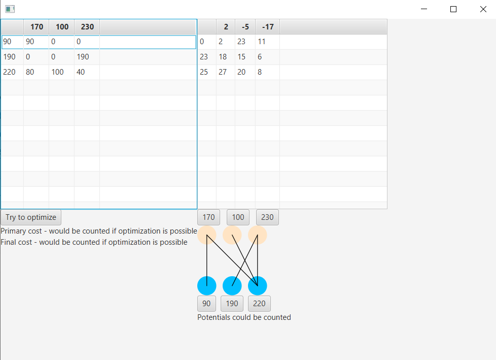

# **Transport Optimization**

## Team
- Nikita Dukin
## High-Level Overview
- Project is going to make the road of transport problem and optimize it by method of potential
- *Road transport problem* is the process to deliver all stuff's points (it could be some products) from producer to the customer
- *Why should it be optimized?* Imagine, you've got some warehouses and some shops. You're gonna transfer your product from warehouses to the shops with minimum cost for delivery (for petrol)  
## Details
- Suggest the solution of transport problem
  - Using method of minimal cost or North-West angle
  - Minimal cost is a method, which generate solution by chosing the minimal prices (cost-coefficients)
  - North-West angle is a method, which generate a solution by moving from North and West part of the table with cost-coefficients
- Try to optimize it by method of potential
  - Method of potential is a method, which chose the most aberrant way for transfer
  - Then it finds the tree, which should be optimized
  - Optimize it by changing the amount of necessary stuff's points to deliver
  - Analize if there are other aberrant ways  
- Give a solution and write a minimal cost for transfer
  - Count the price for delivering all stuff's points before and after optimizations  
- Make an interface using javaFX to show table and graph
  - Interface is going to show the table with cost-coefficients and optimization tree
## Repo
- https://github.com/Fant1k34/transportOptimization
## How to use the project
- **There are two different ways to use this project**
  - Write your data into these two text areas like table-info (look to the picture)
  - **Left** text area is for plan
  - **Right** text area is for matrix costs
  - Every symbol must be divided by a whitespace (to add new column) or enter (to add a new row)
  - Press the butten to optimize
- **The another one**
  - Write your data to consumers A and providers B
  - Write your matrix costs to right text area
  - Click the button
  - The bottom **left** button give a solution by **North-West method**
  - The bottom **right** button give a solution by **Minimal Costs method**

- You would get the primary plan (genered by one method or your plan) and potentials (if it is possible to count)
- Click to the button and plan, and matrix costs would change by method of potentials
- When the button change the name - it would be useful to click, because you have got the optimized plan
- If for some reasons (the graph would not be the tree and have m+n-1 nodes) you would not optimize the plan any more

